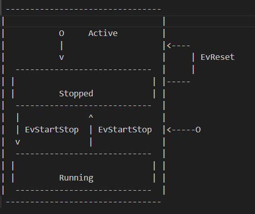

# Stopwatch State Machine Example

This project implements a simple stopwatch using a state machine based on the Boost Statechart library. The stopwatch can start, stop, reset, and display the elapsed time.

### UML Diagram



### Code Explanation

The code uses the Boost Statechart library to define a state machine with the following states and transitions:
- **Active**: The base state of the stopwatch.
- **Stopped**: The stopwatch is not counting time.
- **Running**: The stopwatch is counting time.

### Classes and Events

- **Events**: `EvStartStop`, `EvReset`
- **State Machine**: `StopWatch`
- **States**: `Active`, `Stopped`, `Running`
- **Elapsed Time Interface**: `IElapsedTime`

#### State Definitions

- **Active**: The base state containing the `elapsedTime_` variable and its getter methods.
- **Stopped**: Inherits from `Active` and implements the `ElapsedTime()` method to return the current elapsed time without incrementing it.
- **Running**: Inherits from `Active` and implements the `ElapsedTime()` method to return the current elapsed time with the additional time since it started running.

#### Transitions

- **EvStartStop**: Toggles between `Stopped` and `Running` states.
- **EvReset**: Resets the elapsed time and transitions to `Active`.

### Main Function

The main function initializes the state machine and provides a simple console interface to control the stopwatch:

- **Commands**:
  - `s`: Starts or stops the stopwatch.
  - `r`: Resets the stopwatch.
  - `d`: Displays the elapsed time in seconds.
  - `e`: Exits the program.

### Dependencies

- Boost Statechart Library

### Building and Running

1. **Install Boost**:
   - On Debian-based systems: `sudo apt-get install libboost-all-dev`
   
2. **Compile the Code**:
   ```sh
   g++ -o stopwatch main.cpp -lboost_system -lboost_serialization


Notes
Helper Functions:
```
GetKey(): Reads a character from the input.
clearLines(int numLines): Clears a specified number of lines in the console.
```
Abstract Function:

```
IElapsedTime::ElapsedTime(): Provides a uniform interface to get the elapsed time from both Stopped and Running states.
```

This example demonstrates a simple use case of the Boost Statechart library to create a state machine for a stopwatch application, showcasing transitions between different states and handling of events.